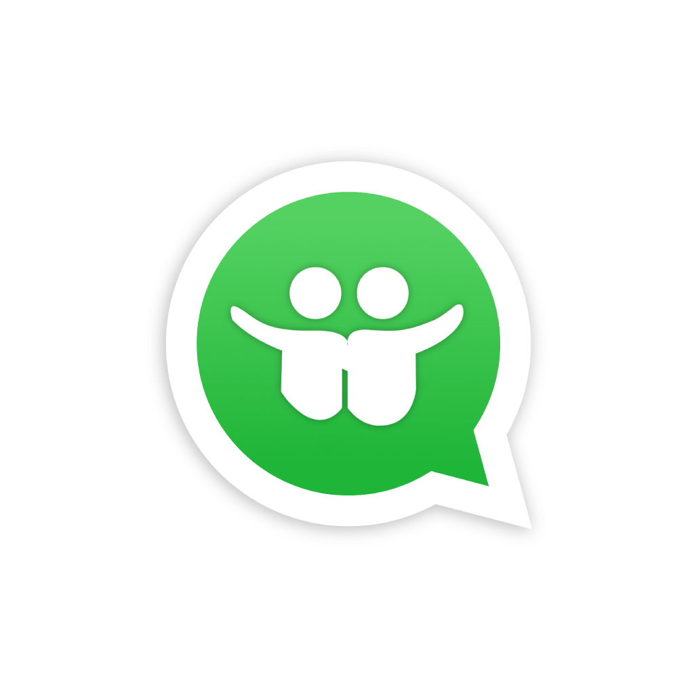

# WhatzUp

Social media app inspired on WhatsApp, but specifically for connecting people at social events.

### Ready-to-deploy APK:
https://github.com/jtsimoes/CM/releases/latest/download/whatz_up.apk

### Minimum requirements:
Android 6.0 (Marshmallow) with 70 MB of free storage

### Permissions required:

* Internet (WiFi or mobile data)
* Bluetooth
* Location/GPS (fine and coarse)
* Calendar (read and write)
* External storage (read and write)